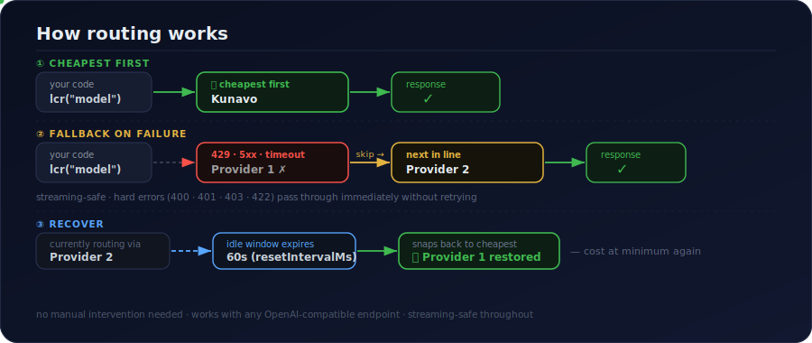

# ai-lcr — AI 最低成本路由（Least Cost Routing）

<p align="center">
  <a href="./README.md">English</a> · <b>简体中文</b>
</p>

<p align="center">
  <b>LLM 调用的自动最低成本路由。一行代码，降低 AI 账单。</b>
</p>

<p align="center">
  <a href="https://www.npmjs.com/package/ai-lcr"></a>
  
  <a href="https://ai-sdk.dev"></a>
</p>

<p align="center">
  
</p>

同一个模型在不同 provider 上的价格不同——而且没有任何单一 provider 在所有模型上都最便宜。`ai-lcr` 为每个模型维护一份「最便宜优先」的列表，路由到其中最便宜且健康的 provider（下表中的 ⭐），失败时向下穿透——这正是电话运营商几十年来一直在做的 [最低成本路由（Least Cost Routing）](https://en.wikipedia.org/wiki/Least-cost_routing)。

> 🚧 早期开发阶段——API 可能变化。稳定版发布前会先在生产环境 dogfood。

## 安装

```bash
npm install ai-lcr
```

`ai`（Vercel AI SDK）是 peer dependency。

## 快速开始

```ts
import { createLCR } from "ai-lcr";
import { createOpenAICompatible } from "@ai-sdk/openai-compatible";
import { generateText } from "ai";

const kunavo = createOpenAICompatible({
  name: "kunavo",
  baseURL: "https://api.kunavo.com/v1",
  apiKey: process.env.KUNAVO_API_KEY,
});
const openrouter = createOpenAICompatible({
  name: "openrouter",
  baseURL: "https://openrouter.ai/api/v1",
  apiKey: process.env.OPENROUTER_API_KEY,
});

const lcr = createLCR({
  autoSort: true, // 按 `cost` 把每个模型的 provider 排成最便宜优先
  models: {
    // 一个逻辑模型，跨多个 provider 最便宜优先地提供服务。
    "gemini-3-flash": [
      { model: kunavo("gemini-3-flash"), label: "kunavo", cost: { input: 0.35, output: 2.1 } },
      { model: openrouter("google/gemini-3-flash-preview"), label: "openrouter", cost: { input: 0.5, output: 3.0 } },
    ],
  },
  // 看清每次调用的实际花费，以及由哪个 provider 提供。
  onCost: ({ provider, costUsd }) => console.log(`${provider}: $${costUsd.toFixed(6)}`),
});

const { text } = await generateText({
  model: lcr("gemini-3-flash"),
  prompt: "Explain Least Cost Routing in one sentence.",
});
```

`cost` 和 `label` 都是可选的——如果你不需要成本核算或 `autoSort`，可以直接传裸模型（`kunavo("gemini-3-flash")`）。`lcr("gemini-3-flash")` 返回一个标准的 AI SDK 模型，因此可与 `generateText`、`streamText`、`generateObject`、工具调用和 agent 一起使用。

## 它如何路由

1. **最便宜优先。** provider 按顺序依次尝试——把它们排成最便宜优先，或设置 `autoSort: true` 让它按 `cost` 自动排序。
2. **失败时向下穿透。** 遇到可重试的错误（限流、5xx、超时）时，前进到下一个 provider，且对流式安全。硬错误（400、401、403、422）会直接透传，不做重试。
3. **恢复。** 在一段空闲窗口（`resetIntervalMs`，默认 60s）之后，自动回到最便宜的 provider。

<p align="center">
  
</p>

## 支持的 provider

任何 OpenAI 兼容的 endpoint 都可用。

- **文本：** [OpenRouter](https://openrouter.ai)（覆盖最广，列表定价）· [Kunavo](https://kunavo.com/?ref=hJ2uT3iW)（**全模型 7 折**）
- **图像 / 视频：** [Kunavo](https://kunavo.com/?ref=hJ2uT3iW)（**7 折**）· [fal.ai](https://fal.ai) · [Runware](https://runware.ai) —— 路由功能在路线图中

## 文本模型价格

单位为每 100 万 token 的美元价格，input / output。官方价格截至 2026-05——请向各 provider 核对当前价格。OpenRouter 直接透传列表价；Kunavo 在官方价基础上统一 7 折。

| 模型 | 官方价（in / out） | OpenRouter | [Kunavo](https://kunavo.com/?ref=hJ2uT3iW) | 最便宜 |
|---|---|---|---|---|
| Gemini 3 Flash | $0.50 / $3.00 | 无折扣 | −30% | ⭐ Kunavo |
| Gemini 3 Pro / 3.1 Pro | $2.00 / $12.00 | 无折扣 | −30% | ⭐ Kunavo |
| Gemini 2.5 Pro | $1.25 / $10.00 | 无折扣 | −30% | ⭐ Kunavo |
| Gemini 2.5 Flash | $0.30 / $2.50 | 无折扣 | −30% | ⭐ Kunavo |
| Claude Sonnet 4.6 | $3.00 / $15.00 | 无折扣 | −30% | ⭐ Kunavo |
| Claude Haiku 4.5 | $1.00 / $5.00 | 无折扣 | −30% | ⭐ Kunavo |
| DeepSeek V4 | $0.43 / $0.87 | 无折扣 | 未提供 | ⭐ OpenRouter |

Kunavo 提供 Anthropic + Google。DeepSeek / OpenAI / Grok / Mistral 路由到 OpenRouter——一份配置即可混用全部。

## 图像模型价格

单位为每张图的美元价格，截至 2026-05（provider 列表价 / 零售价；请核对当前价格）。Kunavo 为官方价 7 折。fal 与 Runware 是算力 provider——`ai-lcr` 为每个模型挑选最便宜的那个（⭐）。

| 模型 | fal.ai | Runware | [Kunavo](https://kunavo.com/?ref=hJ2uT3iW) | 最便宜 |
|---|---|---|---|---|
| Nano Banana 2 | $0.080 | $0.069 | $0.047 | ⭐ Kunavo |
| Nano Banana Pro | $0.080 | — | $0.094 | ⭐ fal |
| GPT-Image-2 | $0.210 | $0.094 | $0.089 | ⭐ Kunavo |
| Imagen 4 Ultra | $0.060 | $0.060 | — | ⭐ fal / Runware |
| Ideogram V3 | $0.060 | $0.060 | — | ⭐ fal / Runware |
| Seedream 4 | $0.030 | — | — | ⭐ fal |
| Flux 1.1 Pro | $0.040 | $0.040 | — | ⭐ fal / Runware |
| Flux Dev | $0.025 | $0.025 | — | ⭐ fal / Runware |
| Flux Schnell | $0.0030 | $0.0013 | — | ⭐ Runware |
| Qwen-Image | — | $0.0038 | — | ⭐ Runware |
| FLUX.2 Klein 4B | — | $0.0006 | — | ⭐ Runware |

## 视频模型价格

单位为每秒的美元价格，截至 2026-05——请核对当前价格。视频计费方式因 provider 而异，因此无法做严格对等的跨 provider 表格：fal.ai 和 Runware 按秒计费，而 Kunavo 的 Veo 按段计费（Fast ~$0.28 / Lite ~$0.168 / Quality ~$1.34）。下表为 fal.ai 的每秒价格（测试中的视频主力）；fal / Runware / Kunavo 的归一化对比是一个 TODO。

| 模型 | fal.ai（$/s） |
|---|---|
| Seedance Lite | $0.036 |
| Hailuo 02 Standard | $0.045 |
| LTX-2 | $0.060 |
| Kling 2.6 Pro | $0.070 |
| WAN 2.2 | $0.080 |
| Veo 3.1 Lite | $0.080 |
| Kling V3 Pro | $0.112 |
| Seedance Pro | $0.124 |
| Veo 3.1（audio-on） | $0.400 |

## 路线图

- [x] 自有 failover 引擎——最便宜优先路由 + 流式安全的 fallback，不依赖外部路由库
- [x] 真实的逐次调用成本核算（`onCost`）
- [x] 基于各 provider `cost` 的自动最便宜优先排序（`autoSort`）
- [ ] 内置价格表，实现零配置定价（省去手填 `cost` 数字）
- [ ] provider 怪癖中间件（透明地修补已知的各 provider 请求怪癖）
- [ ] 离线能力探测（工具调用 / 缓存 / 流式）→ 信任矩阵
- [ ] 图像与视频模型路由（fal.ai / Runware / Kunavo）

## 联盟（Affiliate）披露

`ai-lcr` 是 provider 中立的，可与任何 OpenAI 兼容的 endpoint 配合使用。作者与 **[Kunavo](https://kunavo.com/?ref=hJ2uT3iW)** 之间存在联盟（affiliate）关系——在官方价 7 折的情况下，它往往（但并非总是）是最便宜的选项，正如上面的表格所示。通过该链接注册可能会让作者获得一份分成。你完全不必使用它；自带 provider，路由功能照常工作。

## 开发

```bash
npm install
npm run typecheck
npm test          # mock 的路由 / failover 测试 + 真实 Kunavo 测试
```

测试套件覆盖了：最便宜优先路由、可重试错误时的 failover（以及遇到 400 时*不*做 failover）、穷尽整条链路，以及一次真实的「provider 故障 → Kunavo 恢复」。真实测试仅在环境变量 `KUNAVO_API_KEY` 设置时运行，否则跳过。

## 致谢

流式安全的 failover 方案改编自 [`ai-fallback`](https://github.com/remorses/ai-fallback)（MIT）——在内部重新实现，使 ai-lcr 拥有自己的引擎，并把成本核算 + 路由直接融入其中。基于 [Vercel AI SDK](https://ai-sdk.dev) 构建。

## 许可证

[MIT](./LICENSE) © Victor
